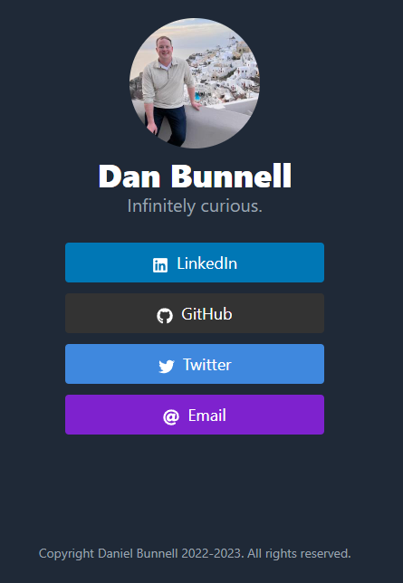

# danbunnell.com

This is a static site generator project that builds my personal profile website.

## Instructions

To run a local server:

1. In VSCode, run "Dev Containers: Reopen Folder in Container"
2. Run `hugo server`

To build the static site:

1. Run `hugo`
2. Refer to the `public/` folder

To deploy:

1. Compress the `public/` folder
2. Upload to netlify.com

## About the Project

The following technologies are used in the project:

- Site
  - [Hugo](https://gohugo.io): a static site generator built on Go
  - [Lynx theme](https://github.com/jpanther/lynx): the site theme we are using
- Development Containers: for a simplified development environment
  - [Development Containers](https://containers.dev/)
  - [VSCode Dev Containers](https://code.visualstudio.com/docs/devcontainers/containers)
  - [DevContainer Feature: Go](https://ghcr.io/devcontainers/features/go:1)
  - [DevContainer Feature: Hugo](https://ghcr.io/devcontainers/features/hugo:1)